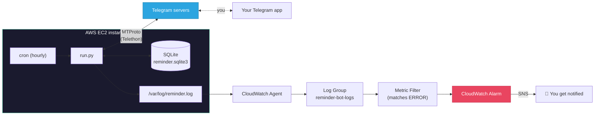
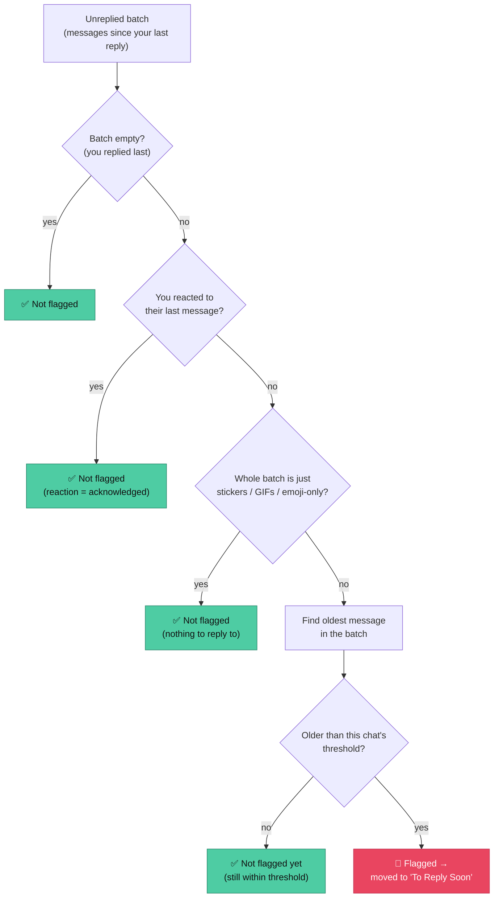

# telegram-reply-reminder


I keep forgetting to reply people on Telegram. Chat goes quiet, few days pass,
then I feel bad lol. So I built this — a bot that watches my own Telegram
account and tells me exactly which chats I'm ghosting, right inside Telegram
itself.

It runs on a schedule, checks all my 1:1 chats and small group chats, figures
out which ones actually need a reply from me, and moves them into a Telegram
folder called **"To Reply Soon"**. Reply to someone and it auto-removes them
from that folder next run. No app, no dashboard, no extra thing to check —
just a folder that stays honest.

**Quick highlights:**
- Logs in as a real Telegram account via **Telethon (MTProto)** — not the Bot
  API, so it can read your existing DMs and manage native Telegram folders.
- Built **test-driven** — 31 unit tests on the core decision logic, zero live
  Telegram connection needed to run them.
- Manages Telegram's internal **dialog filter API** to move chats in/out of a
  folder programmatically.
- Runs unattended on **AWS EC2** via cron, with a self-throttle workaround
  for cron's "every N hours" limitation, plus **CloudWatch** alarms so a
  failed run doesn't go unnoticed.
- Lets you manage priority tiers (close friends/family) by **texting
  yourself commands** in Telegram — no separate admin UI needed.

## Table of contents

- [What it actually does](#what-it-actually-does)
- [Architecture](#architecture)
- [Tech stack](#tech-stack)
- [How the "unanswered" check works](#how-the-unanswered-check-works)
- [Project structure](#project-structure)
- [Setup](#setup)
- [Usage](#usage)
- [Deploying it (AWS EC2 + cron + CloudWatch)](#deploying-it-aws-ec2--cron--cloudwatch)
- [Out of scope](#out-of-scope-for-now)

## What it actually does

- Scans your 1:1 chats + group chats (small ones only, see below).
- A chat is "unanswered" if the last message(s) are from them, not you, and
  they're getting old (past a threshold you set).
- **Not everything needs a reply.** If the last messages are just stickers,
  GIFs, or emoji-only ("😂😂", "👍") — it skips it. That's not a real
  message, no need to flag it.
- **Reacted = acknowledged.** If you put a reaction (❤️/👍/whatever) on their
  last message, bot treats it as answered. You already responded, just not
  with words.
- **Group chats under 10 people** get checked too, same rules. Bigger groups
  (10+) get ignored completely — too noisy, not really "your" conversation
  to reply to.
- **Close friends & family get faster reminders.** You can tag people into a
  `close` or `family` tier — they get a shorter default threshold than
  everyone else. No CLI needed for this, you just text yourself in Telegram
  (see commands below).
- **Per-chat custom threshold** if tiers aren't enough — set an exact number
  of hours for one specific chat.
- Runs unattended on a cron job, self-throttles to roughly every 36 hours
  (explained below cuz cron can't actually do "every 36h" natively).

## Architecture



`run.py` is the only thing that talks to Telegram. SQLite is local
state (thresholds, tiers, what's flagged, last-run time) — no external
database, no server to manage. If something breaks, it shows up in the log,
which CloudWatch is watching, which pages you.

## Tech stack

- **Python 3.11+**
- **[Telethon](https://docs.telethon.dev/)** — MTProto client library. This
  logs in as *your actual Telegram account*, not a bot. Only way to read
  your existing DMs and manage folders (dialog filters) the way this needs.
- **SQLite** (stdlib `sqlite3`) — stores per-chat thresholds, tiers, what's
  currently flagged, and the last-run timestamp. One file, zero setup.
- **python-dotenv** for config.
- **pytest** for the core logic (fully unit tested, no live Telegram needed
  for that part).
- **AWS EC2 + cron + CloudWatch** for actually running it unattended.

## How the "unanswered" check works

For each eligible chat, take every message they sent since your last message
(could be 1, could be a wall of 10 — this is the "unreplied batch"), then:



The "threshold" itself is resolved with this precedence (first one that's
set wins): **manual per-chat override → tier (close/family) → global
default.**

## Project structure

```
telegram-reply-reminder/
├── run.py                      # cron entry point — the whole pipeline runs from here
├── login.py                    # one-time interactive Telegram login
├── set_threshold.py            # CLI: list chats, set/clear per-chat threshold
├── reminder/
│   ├── logic.py                # pure decision logic — zero I/O, fully unit tested
│   ├── commands.py             # parses /close, /family, /remove commands
│   ├── db.py                   # SQLite persistence (thresholds, tiers, flags, run state)
│   └── telegram_client.py      # Telethon integration layer (folders, messages, reactions)
├── tests/                      # 31 pytest tests, covers logic.py + commands.py + db.py
├── .env.example                # config template
└── README.md
```

`reminder/logic.py` has zero Telethon/database imports on purpose — it's the
part that's fully unit tested. `reminder/telegram_client.py` is the only
place that talks to the real Telegram API.

**Running the tests** (no Telegram account needed for this part):

```bash
pip install -r requirements-dev.txt
pytest tests/ -v
```

## Setup

1. Get your Telegram API credentials from **[my.telegram.org](https://my.telegram.org)**
   (API ID + API hash — this is not a bot token, it's for your own account).

2. Clone and install:

```bash
git clone https://github.com/sundarrr22/telegram-reply-reminder.git
cd telegram-reply-reminder
python -m venv .venv
source .venv/bin/activate   # Windows: .venv\Scripts\activate
pip install -r requirements-dev.txt
```

3. Copy `.env.example` to `.env` and fill it in:

```bash
cp .env.example .env
```

```
TELEGRAM_API_ID=
TELEGRAM_API_HASH=
SESSION_NAME=reminder
DEFAULT_THRESHOLD_HOURS=24
CLOSE_THRESHOLD_HOURS=6
FAMILY_THRESHOLD_HOURS=12
MAX_GROUP_SIZE=10
FOLDER_NAME=To Reply Soon
RUN_INTERVAL_HOURS=36
DB_PATH=reminder.sqlite3
```

4. Log in once (interactive — asks for phone number + the code Telegram
   sends you):

```bash
python login.py
```

This saves a `reminder.session` file. Keep that file secret — it's basically
your login. After this, no more manual login needed.

## Usage

Run it:

```bash
python run.py
```

First run creates the "To Reply Soon" folder in your Telegram if it doesn't
exist yet, then scans your chats and files the unanswered ones in. Run it
again whenever — it self-throttles so it only actually does the scan once
every `RUN_INTERVAL_HOURS`.

### Managing close friends / family

No CLI for this one — just text **yourself** in Telegram Saved Messages:

```
/close @some_username      → tags that chat as "close friend" (faster threshold)
/family @some_username     → tags that chat as "family" (its own threshold)
/remove @some_username     → untags them, back to default
```

Next time `run.py` runs, it reads these commands from Saved Messages, applies
them, and deletes the command message so your Saved Messages stays clean. If
it can't find the username, it leaves the message there so you notice and
fix the typo.

### Setting a custom threshold for one specific chat

```bash
python set_threshold.py list                # lists all your 1:1 chats with their chat_id
python set_threshold.py set <chat_id> 6      # this chat: flag if unanswered > 6h
python set_threshold.py clear <chat_id>      # remove the override
```

## Deploying it (AWS EC2 + cron + CloudWatch)

This part is manual — I'm not shipping Terraform for a personal script, just
following these steps on your own EC2 box.

### 1. EC2 setup

```bash
sudo apt update && sudo apt install -y python3-venv git
git clone https://github.com/sundarrr22/telegram-reply-reminder.git
cd telegram-reply-reminder
python3 -m venv .venv
source .venv/bin/activate
pip install -r requirements.txt
cp .env.example .env   # fill in your values
python login.py        # do this once, interactively, over SSH
```

### 2. The cron job — why it's hourly, not "every 36h"

Cron can't natively express "every 36 hours" — 36 doesn't divide 24. So
instead: cron fires **every hour**, and `run.py` itself checks
`RUN_INTERVAL_HOURS` against the last successful run (stored in SQLite) and
just exits immediately if it's not due yet. Real effect: it behaves exactly
like a 36h job, but survives reboots and skipped runs correctly since it's
driven by the actual last-run timestamp, not cron's math.

```bash
crontab -e
```

Add:

```
0 * * * * cd /home/ubuntu/telegram-reply-reminder && .venv/bin/python run.py >> /var/log/reminder.log 2>&1
```

### 3. CloudWatch — catching failed runs

Install the CloudWatch agent on the box, then give it this config so it
ships `/var/log/reminder.log` into a log group called `reminder-bot-logs`:

```bash
sudo tee /opt/aws/amazon-cloudwatch-agent/etc/amazon-cloudwatch-agent.json <<'CFG'
{
  "logs": {
    "logs_collected": {
      "files": {
        "collect_list": [
          {
            "file_path": "/var/log/reminder.log",
            "log_group_name": "reminder-bot-logs",
            "log_stream_name": "{instance_id}",
            "timestamp_format": "%Y-%m-%d %H:%M:%S,%f"
          }
        ]
      }
    }
  }
}
CFG

sudo /opt/aws/amazon-cloudwatch-agent/bin/amazon-cloudwatch-agent-ctl \
  -a fetch-config -m ec2 -s \
  -c file:/opt/aws/amazon-cloudwatch-agent/etc/amazon-cloudwatch-agent.json
```

Then set up:
- A **metric filter** on that log group matching `ERROR` — turns log lines
  into a CloudWatch metric.
- An **alarm** on that metric: if `ERROR` count > 0 in a period, notify you
  (SNS → email is easiest).
- A basic **EC2 status check alarm** on the instance itself, so you know if
  the box goes down entirely, not just if the script errors.

This way if Telegram changes something or the session dies, you find out
same day instead of realizing 2 weeks later your reminders silently stopped.

## Out of scope (for now)

- Broadcast channels and groups with 10+ members — always skipped.
- Multi-account support — one Telegram account per deployment.
- Custom tier names beyond `close` / `family`.
